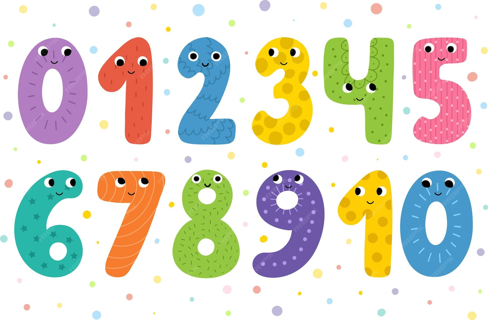

# Happy Numbers Calculator



## Overview
A Python implementation to determine whether a number is a "Happy Number". This project provides a simple and efficient way to check if any positive integer is happy or unhappy.

## Table of Contents
- [What are Happy Numbers?](#what-are-happy-numbers)
- [Project Structure](#project-structure)
- [Usage](#usage)
- [Examples](#examples)
- [Author](#author)

## What are Happy Numbers?
A happy number is defined by the following process:
1. Start with any positive integer
2. Replace the number by the sum of the squares of its digits
3. Repeat the process until:
   - The number equals 1 (making it a happy number)
   - It enters a cycle (making it an unhappy number)

For example:
- 7 is a happy number: 7² = 49 → 4² + 9² = 97 → 9² + 7² = 130 → 1² + 3² + 0² = 10 → 1² + 0² = 1
- 4 is not a happy number: 4² = 16 → 1² + 6² = 37 → 3² + 7² = 58 → 5² + 8² = 89 → 8² + 9² = 145 → 1² + 4² + 5² = 42 → 4² + 2² = 20 → 2² + 0² = 4 (cycle detected)

## Project Structure
```
Happy-Numbers/
├── assets/
│   └── happy_numbers.jpg
├── src/
│   └── main.py
└── README.md
```

## Usage
```python
from src.main import HappyNumber

happy_checker = HappyNumber()
result = happy_checker.is_happy(7)  # Returns True
```

## Examples
```python
happy_checker = HappyNumber()
happy_checker.is_happy(7)   # True
happy_checker.is_happy(44)  # True
happy_checker.is_happy(45)  # False
```

## Author
Mohammadreza Naseri

---
*Feel free to contribute to this project by submitting issues or pull requests.*